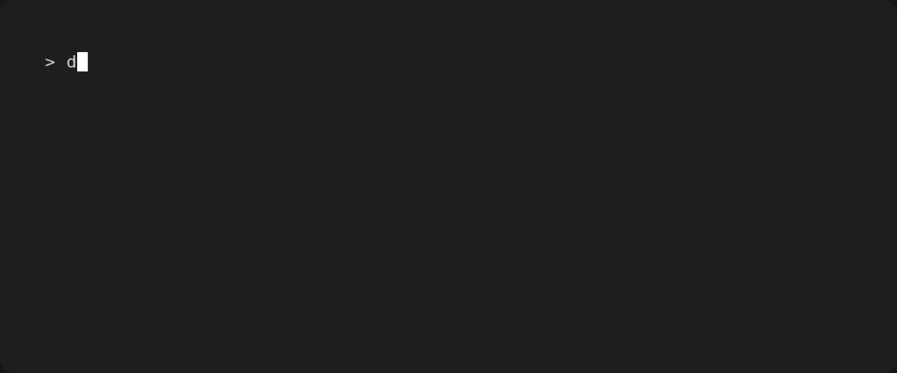

# dstrack

<figure markdown="span">
  { width="200" #dstrack-logo }
  <figcaption></figcaption>
</figure>

**Dataset versioning and monitoring for the machine learning lifecycle.**

`dstrack` helps data scientists and ML engineers track how datasets evolve over time - catching schema drift, distribution shifts, and unexpected mutations before they silently break pipelines or degrade model performance.

## Why dstrack?

Data pipelines break silently. A column gets renamed upstream, a vendor changes a file format, or a feature distribution shifts after a data refresh - and you only find out when model accuracy drops in production.

`dstrack` gives you an audit trail for your datasets so you can catch these problems early, understand what changed, and help you develop your datasets faster.

## What dstrack is (and isn't)

`dstrack` records *semantics* about a dataset - its schema, a content fingerprint, and per-column statistics - not the dataset itself.
It is not a data version control system: unlike DVC, LakeFS, or Git LFS, it never copies your files into a store or pushes them to a
remote, and it cannot check an old version of `data.csv` back out for you. Your data stays wherever it already lives, and `dstrack` keeps a small,
human-readable audit trail beside your code so you can see how that data changed and when. If you need to store and retrieve the bytes, reach for
DVC and use `dstrack` alongside it.

## Features

- **Dataset versioning** - snapshot a dataset and track its lineage across pipeline stages
- **Rich snapshots** - schema hash, content fingerprint, and per-column statistics
- **CSV out of the box** - pure standard-library reader, no heavy dependencies
- **Lightweight CLI** - a small, git-like local store you can commit alongside your code

!!! note "On the roadmap"
    Change detection and drift monitoring - comparing snapshots to surface schema and
    distribution shifts - are planned. See the [roadmap](roadmap.md).

<figure markdown="span">
  
  <figcaption></figcaption>
</figure>

## Installation

```bash
pip install dstrack
```

Requires Python 3.11 or later.

## Quickstart

Initialize a store, then snapshot a dataset:

```bash
dstrack init
dstrack track data.csv
```

```text
ℹ Reading data.csv and computing snapshot...
✔ Snapshot <snapshot-uuid> written (new dataset, dataset <dataset-uuid>).
ℹ Stored at /path/to/.dstrack/datasets/<dataset-uuid>/snapshots/<snapshot-uuid>.json
```

New here? The [Getting Started guide](getting_started.md) walks through the whole flow
step by step.

## License

`dstrack` is distributed under the [MIT License](https://github.com/leoyala/dstrack/blob/main/LICENSE).
